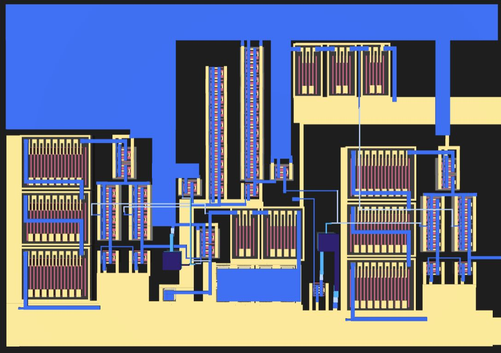
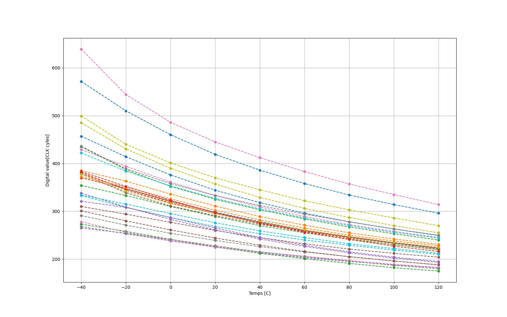
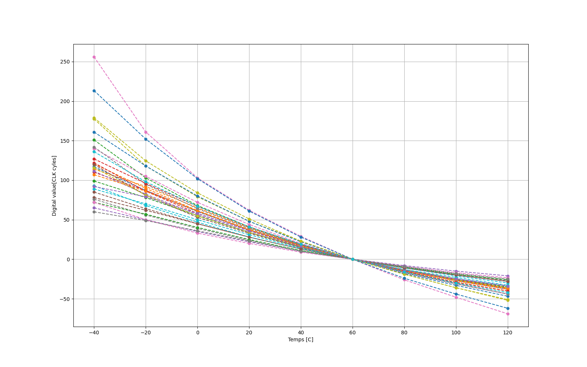
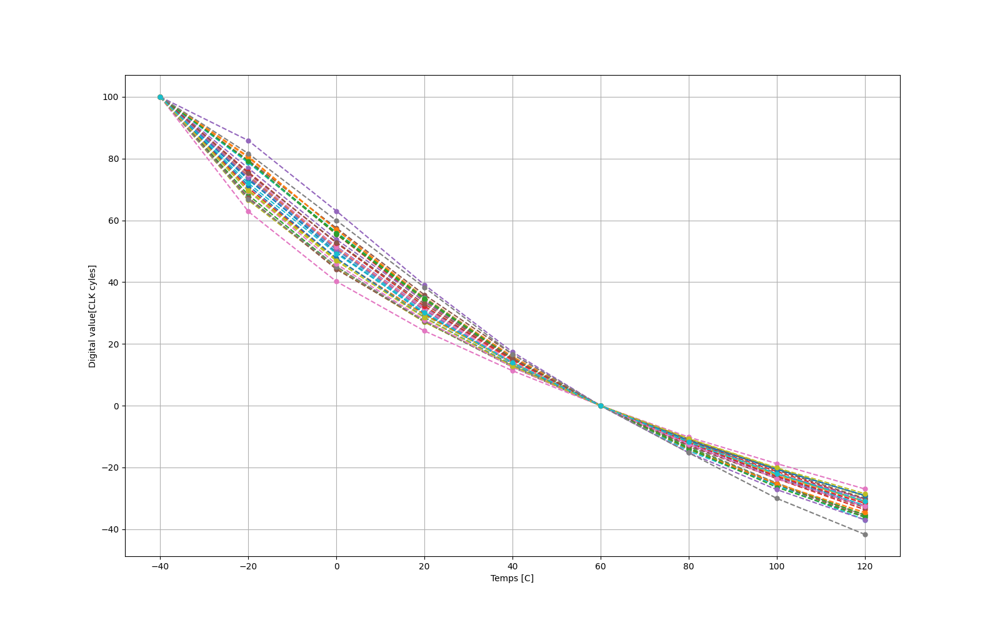
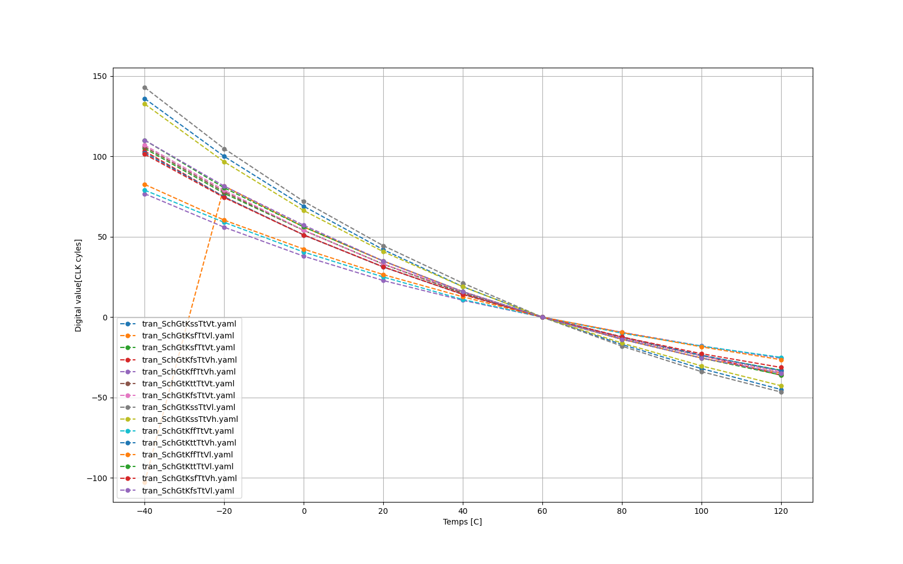
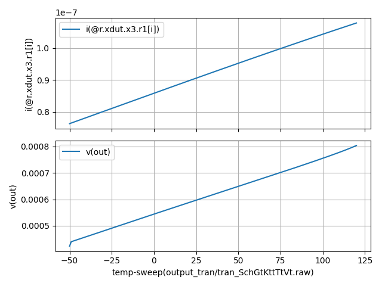
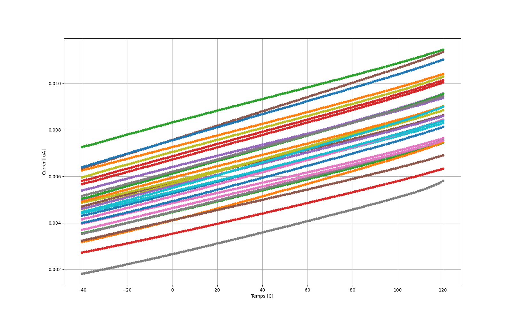
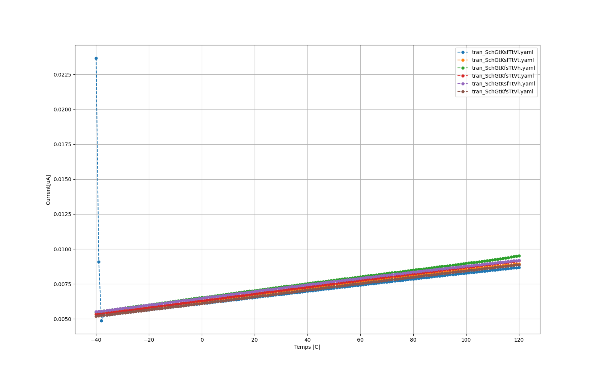
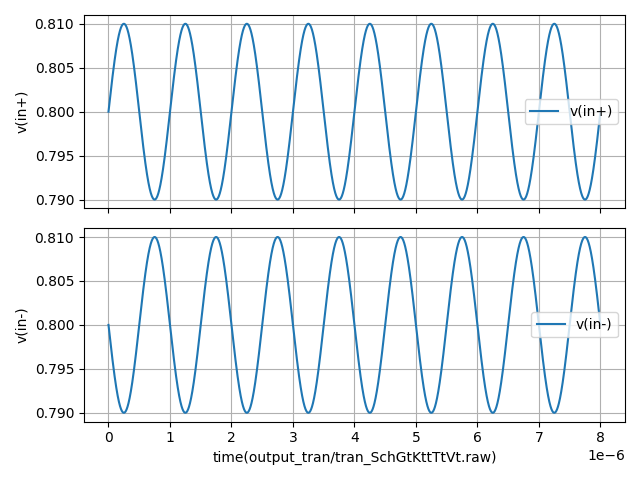
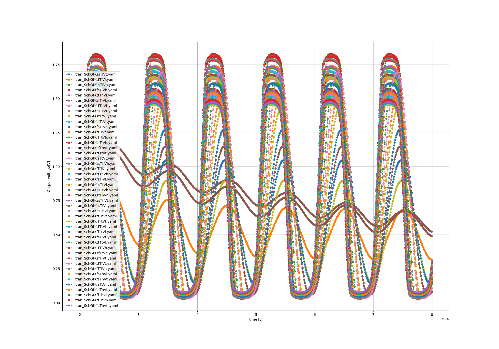

 
<!--- ################################################################################################################# --->

# Who
Gabin Sbaffi, 
Erik K. Jensen &
Renate Klemetsdal
 
<!--- ################################################################################################################# --->

# What
We are making a temperature sensor.

## Specs

| What            |        Cell/Name |
| :-              |  :-:       |
| Schematic       | design/JNW_GR06_SKY130A/JNW_GR06.sch |
| Layout          | design/JNW_GR06_SKY130A/JNW_GR06.mag |

# Changelog/Plan

| Version | Status | Comment|
| :---| :---| :---|
|0.1.0 | :x: | Currently in round 1 of schematic design  |

# Signal interface

| Signal       | Direction | Domain  | Description                               |
| :---         | :---:     | :---:   | :---                                      |
| VDD         | Input     | VDD | Main supply (1.8V)                            |
| VSS         | Input     | Ground  |                                           |

# Key parameters

| Parameter           | Min     | Typ           | Max     | Unit  |
| :---                | :---:     | :---:           | :---:     | :---: |
| Technology          |         | Skywater 130 nm |         |       |
| AVDD                | 1.7    | 1.8           | 1.9    | V     |
| Temperature         | -40     | 27            | 120     | C     |

 
<!--- ################################################################################################################# --->

# Why
For the course TTT4188 Advanced Integrated circuits

 
<!--- ################################################################################################################# --->

# How the circuit works

To describe the circuit i want to split it into two different parts.
1) Circuit to generat the temperature dependent current
2) turning the current into a rising voltage and using it to create a digital output.

## Top level schematic

In this schematic, the PTAT (1) is created inside the block called temp_affected_current. The converting to digital happens with the OTA and the capasitor in the middle bottom. 

Nodes to remember: 
V(cap) is at node CAP
V(OUT) is at the node OUT

 
<!--- ################################################################################################################# --->

## 1. Creating the current

 The current is made by using the temperature dependencies of diodes(imolemented with bipolar transistors) and the size dufferent between the single diode on the left side and the 8 on the right side. The voltage over the left side diode is $V_{DL} = V_T ln\frac{I_D}{I_{L}}$ while the voltage over the diode on the right side is: $V_{DR} = V_T ln\frac{I_D}{I_{SR}}$, where $I_D$ is the equal current in both branches. This eaual current comes from the OTA feedback, which makes the gate voltage for the two PMOS transistors, x2 and x1 . 

 The OTA being ideal also forces  the voltages on both its inputs, V(RIGHT_SIDE) and V(LEFT_SIDE) to be the same, which means that the voltage drop on the left side, over diode $Q1$ is the same as the voltage drop over the resistor $R$ and the 8 diodes $Q2$. this means that $V_R + V_{Q2} = V_{Q1}$ which imples $V_R = V_{Q1} -V_{Q1} = V_T ln\frac{I_D}{I_L} - V_T ln\frac{I_D}{I_R} = V_T ln\frac{I_R}{I_L}$. Since the rightside Diode $Q2$ is 8 times larger than the leftside diode $Q1$ we know that $I_R \approx 8 \cdot I_L$ which means that $V_R \approx V_T ln(8)$. Knowing the voltagedrop over the resistor means we can find the current in the right branch: $I_R = \frac{V_R}{R} = \frac{kT}{q} ln(8)/R$, where T is temperatur, meaning we got a current that increases with temperature. 

 
<!--- ################################################################################################################# --->

## 2. making the current into a digital value.

The current from equation (1) is directed into a capacitor, resulting in a rising voltage. At this point, we assume the current is stable, and the voltage across the capacitor is given by:

$V_c = \frac{1}{C} \int_0^t I  dt$

This equation shows that the voltage increases linearly with time. Consequently, if the current is halved, it takes twice as long to reach the same voltage.
In our case, the current varies ish linearly with temperature. This means that at different temperatures, the voltage across the capacitor, $V_{cap}$, reaches a ceartain voltage value at different times.
We can find a formula for the time required to increase the voltage to 0.6V, which is the voltage used in this circuit.

To turn this rising voltage into a digital signal, we use a comparator. The idea is to check when the voltage exceeds a certain voltage, this case 0.6V.  
If the voltage across the capacitor, $V_{cap}$, is below 0.6V, the output is 0. if its above 0.6V, the output switches to 1. This comparison is done using a comparator, and in this project a OTA is used.

$0.6 = \frac{1}{c} \int_0^t I$ -> $0.6C = I * t$ -> $t = 0.6 \frac{C}{I} $

To convert the rising voltage into a digital signal, we send it into the comparator that checks when it is larger than 0.6V.  
If the voltage across the capacitor, $V_{cap}$, is below 0.6V, the output remains 0. Once it surpasses 0.6V, the output switches to 1. This output is generated using a comparator, and in this design, an OTA is used as an comparator.

After a certain period, which is going to be constnat, maybe 20us, the circuit's reset signal goes high, which shorts the capacitor and resets its voltage to 
$V_C = 0 + \text{charge injection}$
From this point, the voltage starts increasing again, taking a time t  to reach the threshold.  
Before the reset signal goes high, the output remains 1. When the circuit resets, the output switches to 0 and then returns to 1 after a certain time t. This time t is proportional to temperature.  
To measure this, we implement a counter—designed in Verilog for this project—that tracks the time from reset until the output goes high again. The counter's output then provides a digital value corresponding to the temperature.

In the picture below one can see how it is in the simulator. This is a very bad picture since the voltage over the capacitor V(cap) is not increasing regularoly and is negativly affected by probobly charge injection, but it show that the capacitor voltage (ornag) rises to about 0.6 before the output voltage (green) starts to rise. One can see the digital value (red) increasing continiusly aswell, we get the digital value by sampling the counter when V(out) becomes high. One can also see that the reset signal (blue) resets the counter and resets and messes with the capacitor voltage.

 
<!--- ################################################################################################################# --->

#Layout
Layout for the top level:

On the left is the temperature to current circuit. In the middle/right one can see the capasitor that is being charged. and on the right is the OTA comparator that creates the outputsignal. VDD is on metal1(orange) and VSS is on locali(Blue).

A 3d picture of the layout:

# comments on the current state of the circuit

Some informal comments on the circuit. I did not simulate on the corners and MC before thursdays, so i did not know that it would be so bad. There is a good bit to fix, since the circuit kinda works, but it does so poorly. This is most likely because of the OPPAMP not wroking to well(as you can see in the simulation results on the bottom of the page). It has problems when i change voltages. This is a result of me not really designing it well, i thought it would just work, "since how hard could a simple oppamp be" :(((. 
I am quite certain that the current mirror transistor does not have a high enough VSD and that is why its not working. I have tried to make it a two stage to increase the output swing, and managed to get positive feedback. I have also tried to do som more thought out design, like reducing the needed VDS  for the transistors, increasing gm/Id for the inputs and decreasing for the diode copled ones. I managed to fix the current problem, but created a new problem with ff corners and Vh voltage. 

Another problem i got is charge injection on the voltage over the capacitor, which you can see over in the schreenshot. I will see if i can fix it/reduce it by simply adding a transistor to absorb the voltage. I have dones this before, and it did work, but it created some other problem, so i dropped it, but it think its worth implementing here, i just didnt have time right now.

Some note on the simulations and plots: I have change a good bit in the Makefiles, but it still runs sims. I have also created two plotting scripts. plot.py and mc_plot.py to plot the results. It plots the measured results, since i have not yet learned how to read the raw file. This means that a take a lot of measurments to make it possible to plot. The plotting scripts plots without and with 1 and 2 point calibration and puts the pictures in the picture folder inside the circuit blocks sim folder. But you can see all the results in this readme.

When it comes to the SIM -passed mark. I have only included the typical simulations. this is because the etc(which runs all corners and sometimes all voltages and temps) takes forver, the same with MC.

 
<!--- ################################################################################################################# --->

# Where to find different stuff

## Circuits
### You can find the schematics for all the differenc circuit blocks here: https://analogicus.github.io/jnw_gr06_sky130a/schematic.html 

### JNW_GR06: [/design/JNW_GR06_SKY130A/OTA.sch](/design/JNW_GR06_SKY130A/OTA.sch)\
top level schematic. Shows the whole circuit.

### temp_affected_current: [/design/JNW_GR06_SKY130A/temp_affected_current.sch](/design/JNW_GR06_SKY130A/temp_affected_current.sch) \
The cirecuit block responsible for creating the temperature affected current that is used to create the digital value.

### OTA: [/design/JNW_GR06_SKY130A/temp_affected_current.sch](/design/JNW_GR06_SKY130A/temp_affected_current.sch) \
The OTA that is used in the temp_affected_current and as a comparator.

### COMP: [/design/JNW_GR06_SKY130A/COMP.sch](/design/JNW_GR06_SKY130A/COMP.sch) \
A comparator. did not end up using this.

 

## Testbenches
temp_affected_current TB: [/design/JNW_GR06_SKY130A/TB_temp_affected_current.sch](/design/JNW_GR06_SKY130A/TB_temp_affected_current.sch)\
Testbench for the circuit block that creates the temp affected current. The TB is made so one can look at the dc OP in the circuit.

OTA TB: [/design/JNW_GR06_SKY130A/TB_OTA.sch](/design/JNW_GR06_SKY130A/TB_OTA.sch)\
Testbench for the OTA circuit block. The TB is made so one can look at the dc OP in the circuit.

 
<!--- ################################################################################################################# --->

## Simulations
All simulations can be found in the sim file, inside the folder with the name coresponding to the circuit block. The simulation is called tran.spi. The simulations for the different files can be found here:

### JNW_GR06: [/sim/JNW_GR06/tran.spi](/sim/JNW_GR06/tran.spi) 
This simulat runs a transient analysis with a reset and a digital counter. And checkcs how long it takes the circuits output to go high after it has reset once

### temp_affected_current: [/sim/temp_affected_current/tran.spi](/sim/temp_affected_current/tran.spi)
Runs a DC sweep on temp from -50 to 120 deg C (from -50 so there was less problems with measurments). The output current is measured here at different temperatures.

### OTA: [/sim/JNW_GR06/OTA.spi](/sim/OTA/tran.spi)
Runs a transient simulation with differential input. 

 

### temp_affected_current TB: [sim/TB_temp_affected_current/tran.spi](sim/TB_temp_affected_current/tran.spi)
Simulation is found inside the schematics

### OTA TB: [sim/TB_OTA/tran.spi](sim/TB_OTA/tran.spi)
Simulation is found inside the schematics

 
<!--- ################################################################################################################# --->

## Post processing
There is a bit of different places for posprocessing. One can find all of them inside the sim folder for the circuit block. Its also descirbed where to find and what they do under.

### JNW_GR06
Has a few different post processing
#### [sim/JNW_GR06/tran.meas](sim/JNW_GR06/tran.meas)
Measures when the circuits output is high. This runs on alle the different temperatures from the simulations.

#### [sim/JNW_GR06/plot.py](sim/JNW_GR06/plot.py)
Plots the measurments from tran.meas for when one does all the corners. This plots without calibratio, with 1 point calibration and 2 point calibration

#### [sim/JNW_GR06/plot.py](sim/JNW_GR06/mc_plot.py)
Plots the measurments from tran.meas for mc sim. This plots without calibratio, with 1 point calibration and 2 point calibration. (note: have not fixed so it only takes mc sims yet, but want to soon.)

 

### temp_affected_current
Note: i have added calibration in temp_affected current aswell since it makes it easier to see how well the circuit works.

#### [sim/JNW_GR06/tran.meas](sim/JNW_GR06/tran.meas)
takes measurments from the dc sim on each temp. Is un use since its easier to do + already have script that fixes the output into a ncie plot.

#### [sim/JNW_GR06/plot.py](sim/JNW_GR06/plot.py)
Plots the measurments from tran.meas for when one does all the corners. This plots without calibratio, with 1 point calibration and 2 point calibration

#### [sim/JNW_GR06/plot.py](sim/JNW_GR06/mc_plot.py)
Plots the measurments from tran.meas for mc sim. This plots without calibratio, with 1 point calibration and 2 point calibration. (note: have not fixed so it only takes mc sims yet, but want to soon.)

 

### OTA
#### [sim/OTA/tran.meas](sim/OTA/tran.meas)
NOT IN USE

#### [sim/TB_OTA/tran.py](sim/TB_OTA/tran.py)
makes a plot of the input voltages and the outputvoltages over time from the transient simulation.

 
<!--- ################################################################################################################# --->

# Simulation results
This sections shows the simulations results and some comments around them. All the simulation results can be found in the sim folder, inside the folder named the same as the circuit block and either there as a png or inside a folder named pictures. feks sim/circuit_block/pictures/here.png or sim/circuit_block/here.png.
This section goes throguh the different circuit blocks' results one by one.
This section does not go throug the Test benches' results. Since they are only used to analyse the circuit OP state, and i dont know how to show it well.  

At the JNW_GR06 results you can see CLK cycles on the y axis, this value is how high the counter got.

 
<!--- ################################################################################################################# --->

## JNW_GR06

### The results from a Monte Carlo method simulations With 0 to 2 point calibration
#### No calibration

#### 1 point calibration at 60 deg C

#### 2 point calibration at 60 deg C and -40 deg C

 

### The results from all corners simulated. Voltage was not changed since it made the circuit not work

 

#### NO calibration

 

#### 1 point calibration

 

#### 2 point calibration

 
<!--- ################################################################################################################# --->

## temp_affected_current

### The current out of the PTAT over a 1kohm resistor on typical voltage, and typical corners at 27 deg C

 

## The PTAT current out of the circuit in 30 simulations using MC methode.

## The PTAT current out of the circuit in all corners and voltages.
### The problems you can see at the end is most likely from the oppamp getting a high offset and giving a too high voltage. will look into

 
<!--- ################################################################################################################# --->

## OTA

### OTA input output graph. showing it works in perfect conditions. 

Here is proboly why the circuit doesnt work that well all the time. The OTA sim is kinda weird. I decided to only do typical voltage here, since the circuit break down if we do low or high.

#### INPUT to the OTA

#### Simulation of the corners

#### MC method sims for the OTA 
This result is really weird i have not yet figured out why this happens

 
<!--- ################################################################################################################# --->

