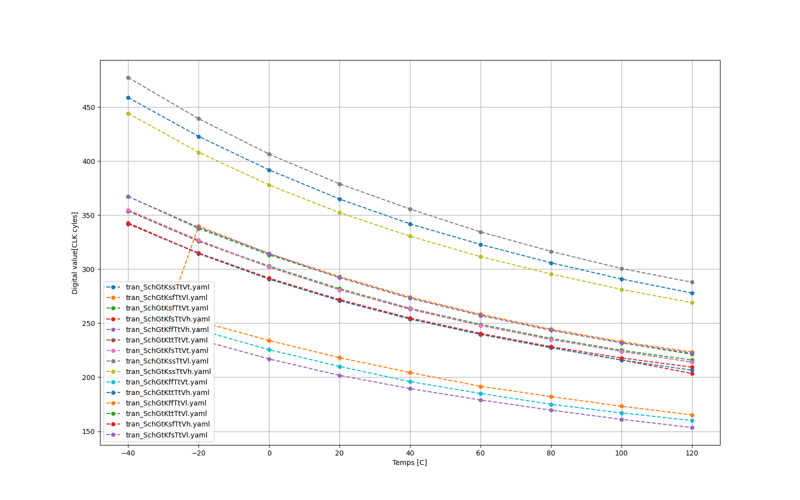
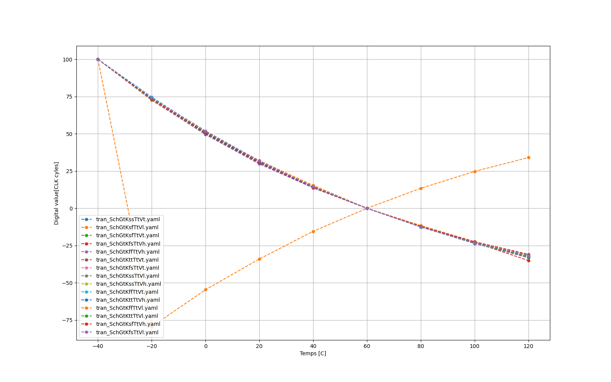

 
<!--- ################################################################################################################# --->

# Who
Gabin Sbaffi, 
Erik K. Jensen &
Renate Klemetsdal
 
<!--- ################################################################################################################# --->

# What
We are making a temperature sensor.

## Specs

| What            |        Cell/Name |
| :-              |  :-:       |
| Schematic       | design/JNW_GR06_SKY130A/JNW_GR06.sch |
| Layout          | design/JNW_GR06_SKY130A/JNW_GR06.mag |

# Changelog/Plan

| Version | Status | Comment|
| :---| :---| :---|
|0.1.0 | :x: | Currently in round 1 of schematic design  |

# Signal interface

| Signal       | Direction | Domain  | Description                               |
| :---         | :---:     | :---:   | :---                                      |
| VDD         | Input     | VDD | Main supply (1.8V)                            |
| VSS         | Input     | Ground  |                                           |

# Key parameters

| Parameter           | Min     | Typ           | Max     | Unit  |
| :---                | :---:     | :---:           | :---:     | :---: |
| Technology          |         | Skywater 130 nm |         |       |
| AVDD                | 1.7    | 1.8           | 1.9    | V     |
| Temperature         | -40     | 27            | 120     | C     |

 
<!--- ################################################################################################################# --->

# Why
For the course TTT4188 Advanced Integrated circuits

 
<!--- ################################################################################################################# --->

# How the circuit works

FYLL INN HER!

 
<!--- ################################################################################################################# --->

# Where to find different stuff

## Circuits
### JNW_GR06: [/design/JNW_GR06_SKY130A/OTA.sch](/design/JNW_GR06_SKY130A/OTA.sch)\
top level schematic. Shows the whole circuit.

### temp_affected_current: [/design/JNW_GR06_SKY130A/temp_affected_current.sch](/design/JNW_GR06_SKY130A/temp_affected_current.sch) \
The cirecuit block responsible for creating the temperature affected current that is used to create the digital value.

### OTA: [/design/JNW_GR06_SKY130A/temp_affected_current.sch](/design/JNW_GR06_SKY130A/temp_affected_current.sch) \
The OTA that is used in the temp_affected_current and as a comparator.

### COMP: [/design/JNW_GR06_SKY130A/COMP.sch](/design/JNW_GR06_SKY130A/COMP.sch) \
A comparator. did not end up using this.

 

## Testbenches
temp_affected_current TB: [/design/JNW_GR06_SKY130A/TB_temp_affected_current.sch](/design/JNW_GR06_SKY130A/TB_temp_affected_current.sch)\
Testbench for the circuit block that creates the temp affected current. The TB is made so one can look at the dc OP in the circuit.

OTA TB: [/design/JNW_GR06_SKY130A/TB_OTA.sch](/design/JNW_GR06_SKY130A/TB_OTA.sch)\
Testbench for the OTA circuit block. The TB is made so one can look at the dc OP in the circuit.

 
<!--- ################################################################################################################# --->

## Simulations
All simulations can be found in the sim file, inside the folder with the name coresponding to the circuit block. The simulation is called tran.spi. The simulations for the different files can be found here:

### JNW_GR06: [/sim/JNW_GR06/tran.spi](/sim/JNW_GR06/tran.spi) 
This simulat runs a transient analysis with a reset and a digital counter. And checkcs how long it takes the circuits output to go high after it has reset once

### temp_affected_current: [/sim/temp_affected_current/tran.spi](/sim/temp_affected_current/tran.spi)
Runs a DC sweep on temp from -50 to 120 deg C (from -50 so there was less problems with measurments). The output current is measured here at different temperatures.

### OTA: [/sim/JNW_GR06/OTA.spi](/sim/OTA/tran.spi)
Runs a transient simulation with differential input. 

 

### temp_affected_current TB: [sim/TB_temp_affected_current/tran.spi](sim/TB_temp_affected_current/tran.spi)
Simulation is found inside the schematics

### OTA TB: [sim/TB_OTA/tran.spi](sim/TB_OTA/tran.spi)
Simulation is found inside the schematics

 
<!--- ################################################################################################################# --->

## Post processing
There is a bit of different places for posprocessing. One can find all of them inside the sim folder for the circuit block. Its also descirbed where to find and what they do under.

### JNW_GR06
Has a few different post processing
#### [sim/JNW_GR06/tran.meas](sim/JNW_GR06/tran.meas)
Measures when the circuits output is high. This runs on alle the different temperatures from the simulations.

#### [sim/JNW_GR06/plot.py](sim/JNW_GR06/plot.py)
Plots the measurments from tran.meas for when one does all the corners. This plots without calibratio, with 1 point calibration and 2 point calibration

#### [sim/JNW_GR06/plot.py](sim/JNW_GR06/mc_plot.py)
Plots the measurments from tran.meas for mc sim. This plots without calibratio, with 1 point calibration and 2 point calibration. (note: have not fixed so it only takes mc sims yet, but want to soon.)

 

### temp_affected_current
Note: i have added calibration in temp_affected current aswell since it makes it easier to see how well the circuit works.

#### [sim/JNW_GR06/tran.meas](sim/JNW_GR06/tran.meas)
takes measurments from the dc sim on each temp. Is un use since its easier to do + already have script that fixes the output into a ncie plot.

#### [sim/JNW_GR06/plot.py](sim/JNW_GR06/plot.py)
Plots the measurments from tran.meas for when one does all the corners. This plots without calibratio, with 1 point calibration and 2 point calibration

#### [sim/JNW_GR06/plot.py](sim/JNW_GR06/mc_plot.py)
Plots the measurments from tran.meas for mc sim. This plots without calibratio, with 1 point calibration and 2 point calibration. (note: have not fixed so it only takes mc sims yet, but want to soon.)

 

### OTA
#### [sim/OTA/tran.meas](sim/OTA/tran.meas)
NOT IN USE

#### [sim/TB_OTA/tran.py](sim/TB_OTA/tran.py)
makes a plot of the input voltages and the outputvoltages over time from the transient simulation.

 
<!--- ################################################################################################################# --->

# Simulation results
This sections shows the simulations results and some comments around them. All the simulation results can be found in the sim folder, inside the folder named the same as the circuit block and either there as a png or inside a folder named pictures. feks sim/circuit_block/pictures/here.png or sim/circuit_block/here.png.
This section goes throguh the different circuit blocks' results one by one.
This section does not go throug the Test benches' results. Since they are only used to analyse the circuit OP state, and i dont know how to show it well.  

 
<!--- ################################################################################################################# --->

## JNW_GR06

### The results from a monte carlo method simulations With 0 to 2 point calibration

 

### The results from a all corners and high, typical and low voltage simulated simulations With 0 to 2 point calibration

 

#### NO calibration

 

#### 1 point calibration

 

#### 2 point calibration

 
<!--- ################################################################################################################# --->

## temp_affected_current

### The current out of the PTAT over a 1kohm resistor on typical voltage, and typical corners at 27 deg C

 

## The PTAT current out of the circuit in 30 simulations using MC methode.

## The PTAT current out of the circuit in all corners and voltages.

 
<!--- ################################################################################################################# --->

## OTA

### OTA input output graph. showing it works in perfect conditions. (have not simulated this one in all corners and such.)

 
<!--- ################################################################################################################# --->

